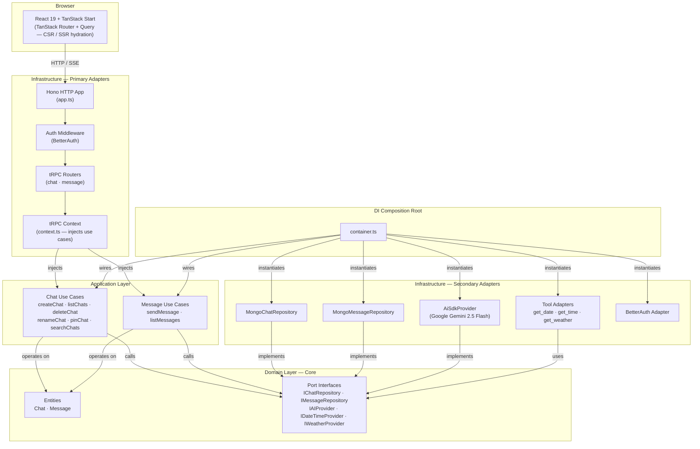
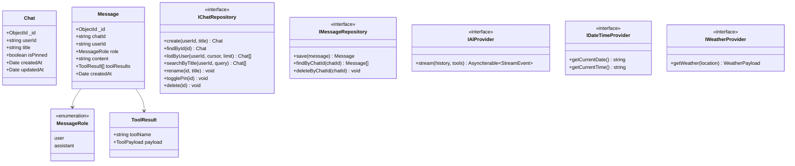
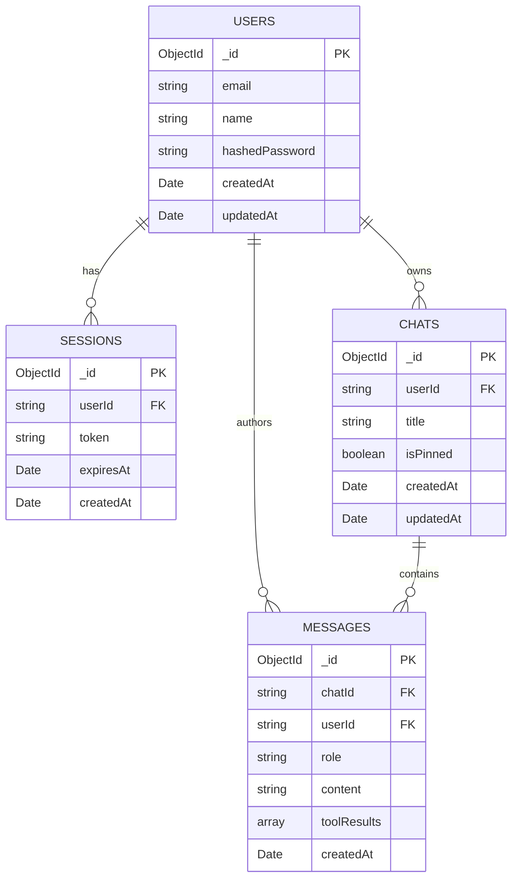
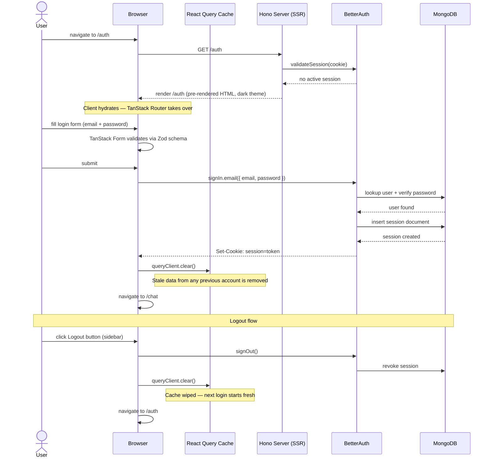
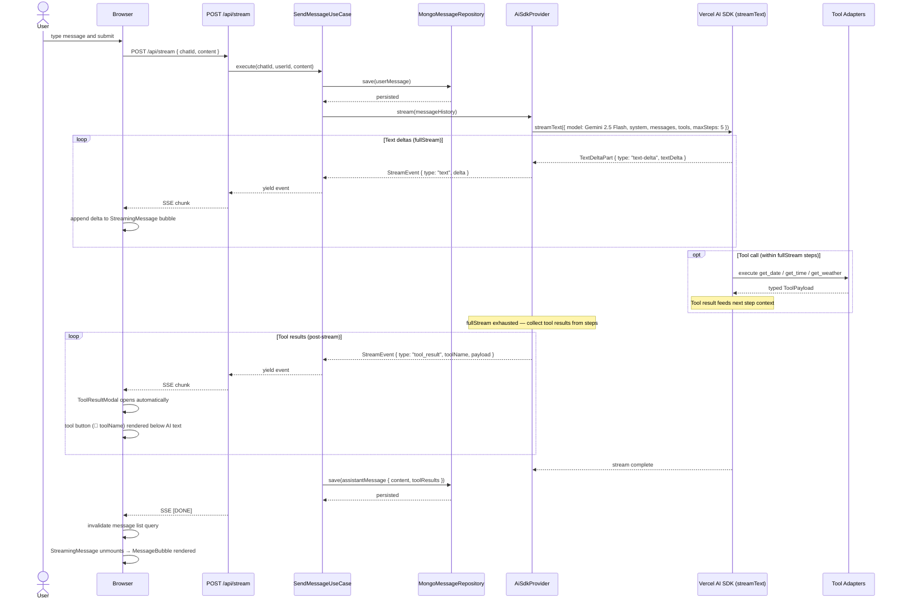
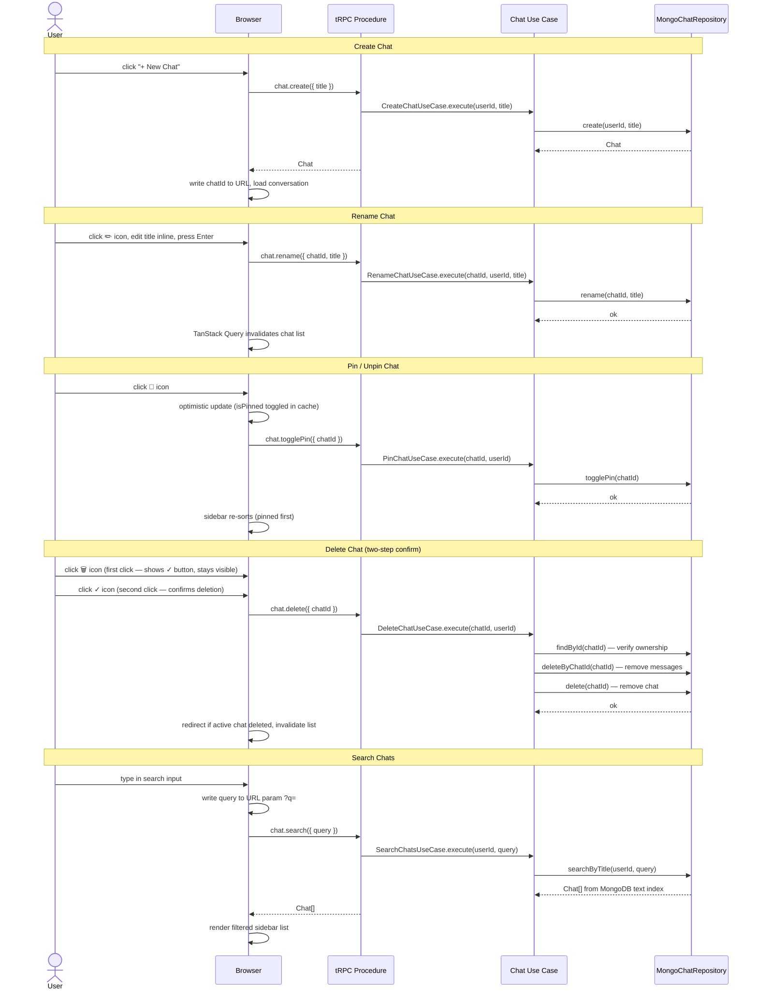
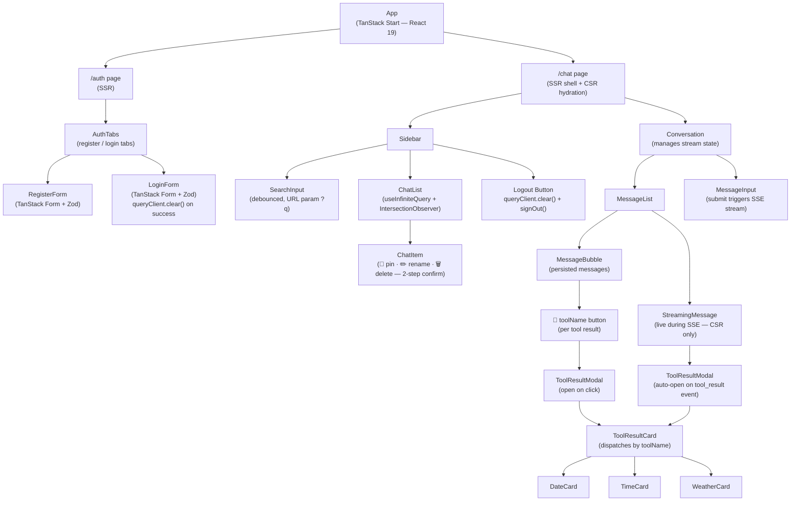
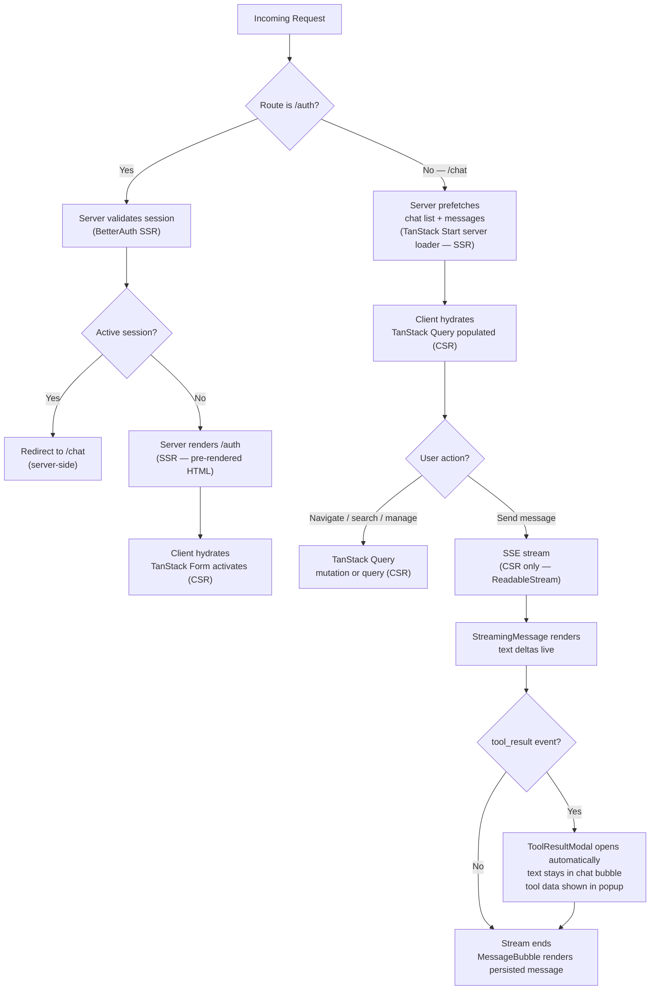
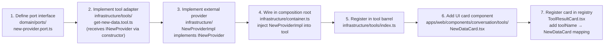

# Diagrams

---

## 1. Architecture Overview — Hexagonal Layers

---

## 2. Class Diagram — Domain Entities & Ports

---

## 3. Class Diagram — Application Use Cases & Infrastructure Adapters

```mermaid
classDiagram
    class SendMessageUseCase {
        -IChatRepository chatRepository
        -IMessageRepository messageRepository
        -IAIProvider aiProvider
        +execute(chatId, userId, content) AsyncIterable~StreamEvent~
    }

    class CreateChatUseCase {
        -IChatRepository chatRepository
        +execute(userId, title) Chat
    }

    class ListChatsUseCase {
        -IChatRepository chatRepository
        +execute(userId, cursor, limit) Chat[]
    }

    class DeleteChatUseCase {
        -IChatRepository chatRepository
        -IMessageRepository messageRepository
        +execute(chatId, userId) void
    }

    class RenameChatUseCase {
        -IChatRepository chatRepository
        +execute(chatId, userId, title) void
    }

    class PinChatUseCase {
        -IChatRepository chatRepository
        +execute(chatId, userId) void
    }

    class SearchChatsUseCase {
        -IChatRepository chatRepository
        +execute(userId, query) Chat[]
    }

    class ListMessagesUseCase {
        -IMessageRepository messageRepository
        +execute(chatId, userId) Message[]
    }

    class MongoChatRepository {
        -Collection~Chat~ collection
        +create(userId, title) Chat
        +findById(id) Chat
        +listByUser(userId, cursor, limit) Chat[]
        +searchByTitle(userId, query) Chat[]
        +rename(id, title) void
        +togglePin(id) void
        +delete(id) void
    }

    class MongoMessageRepository {
        -Collection~Message~ collection
        +save(message) Message
        +findByChatId(chatId) Message[]
        +deleteByChatId(chatId) void
    }

    class AiSdkProvider {
        -LanguageModel model
        -Record~string Tool~ tools
        +stream(history, tools) AsyncIterable~StreamEvent~
    }

    SendMessageUseCase ..> IChatRepository
    SendMessageUseCase ..> IMessageRepository
    SendMessageUseCase ..> IAIProvider
    CreateChatUseCase ..> IChatRepository
    ListChatsUseCase ..> IChatRepository
    DeleteChatUseCase ..> IChatRepository
    DeleteChatUseCase ..> IMessageRepository
    RenameChatUseCase ..> IChatRepository
    PinChatUseCase ..> IChatRepository
    SearchChatsUseCase ..> IChatRepository
    ListMessagesUseCase ..> IMessageRepository

    MongoChatRepository ..|> IChatRepository
    MongoMessageRepository ..|> IMessageRepository
    AiSdkProvider ..|> IAIProvider
```

---

## 4. Entity-Relationship Diagram — MongoDB Collections

---

## 5. Sequence Diagram — Authentication (SSR)

---

## 6. Sequence Diagram — Send Message & AI Streaming (CSR)

---

## 7. Sequence Diagram — Chat Management

---

## 8. Component Tree — Frontend

---

## 9. Flowchart — Rendering Strategy (SSR vs CSR)

---

## 10. Flowchart — Adding a New Tool

---

